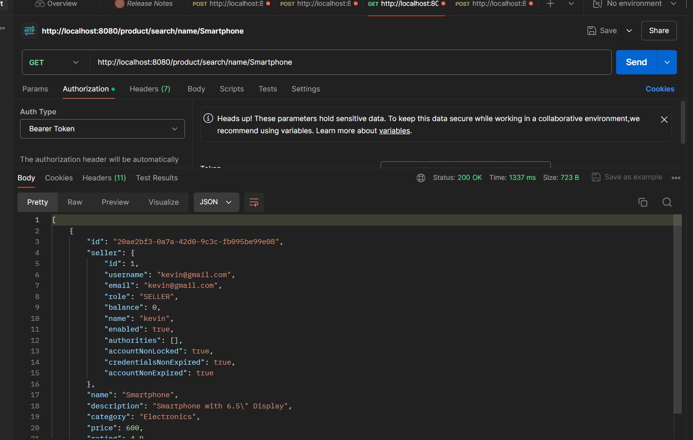
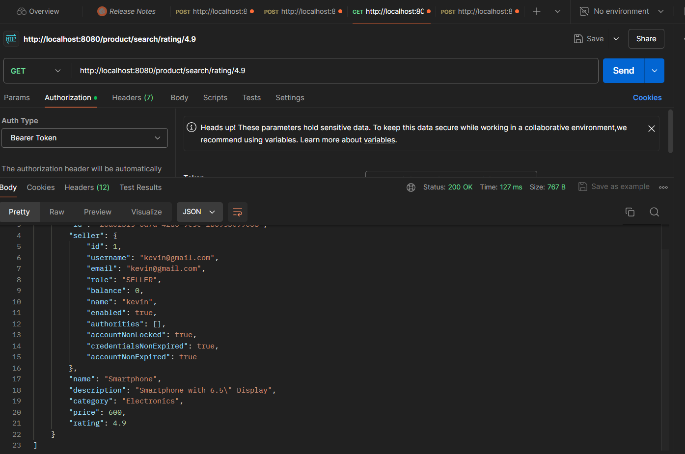
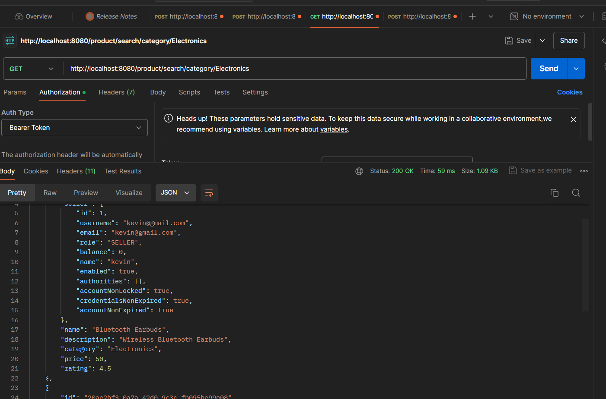
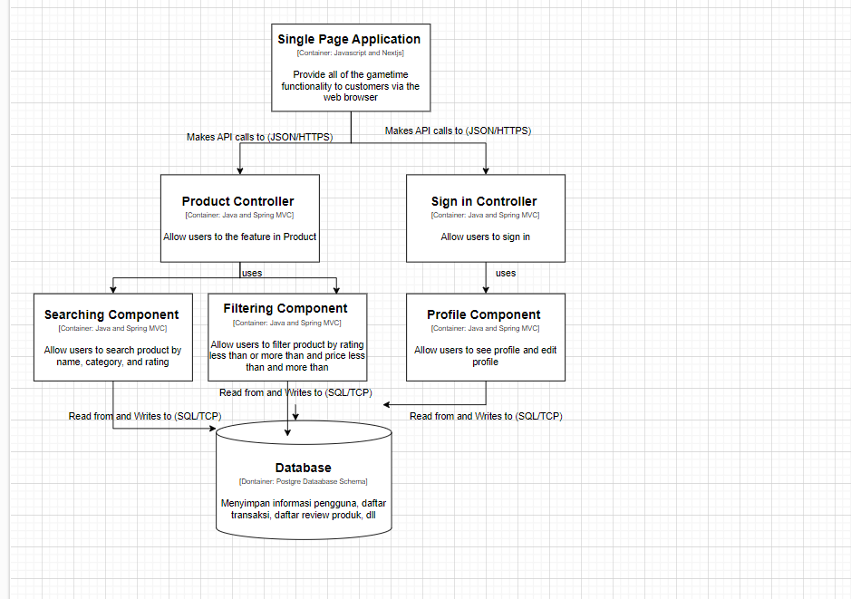
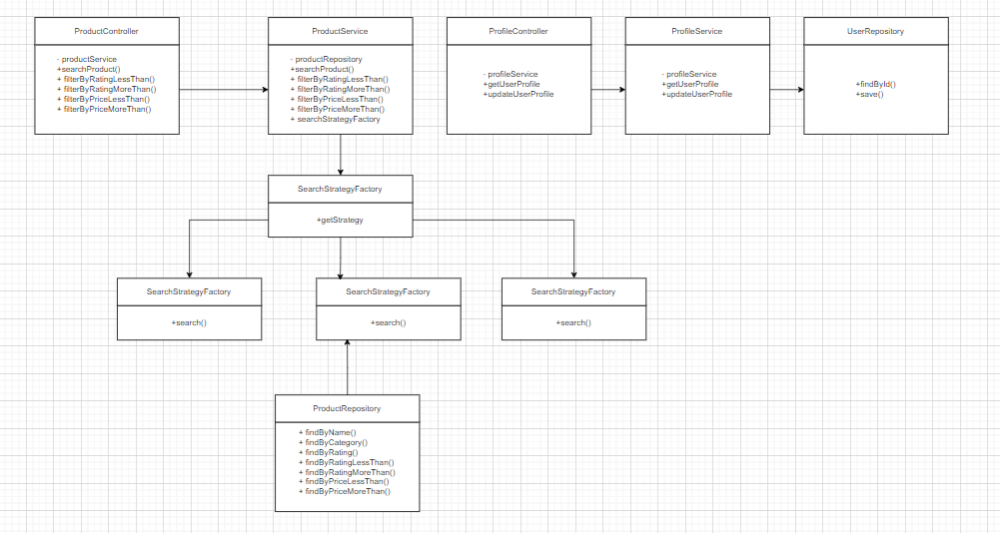

# Game Time

## Link Deployment
https://transaction-p5zxnxph7q-ew.a.run.app/

## Anggota Kelompok
1. Rachel Heningtyas Zanetta Erari - 2206081944
2. Henry Soedibjo - 2206827762
3. Kevin Ignatius Wijaya - 2206083470
4. Robert Benyamin - 2206817383
5. Nadya Hoesin - 2106651673

Bagian Software Architecture part 1:

Arsitektur perangkat lunak adalah kerangka kerja yang mendefinisikan struktur dan perilaku sistem perangkat lunak. Ini mencakup komponen-komponen sistem, hubungan antara komponen tersebut, dan bagaimana mereka berinteraksi satu sama lain. Arsitektur perangkat lunak juga mencakup prinsip-prinsip dan pola yang digunakan untuk merancang dan membangun sistem tersebut. Keputusan arsitektural yang dibuat akan mempengaruhi kualitas sistem seperti keandalan, kinerja, dan keamanan.  Microservices adalah gaya arsitektur perangkat lunak yang merancang aplikasi sebagai kumpulan layanan yang dapat dikerjakan secara independen. Setiap layanan ini berjalan dalam prosesnya sendiri dan berkomunikasi dengan mekanisme ringan, seringkali sebuah HTTP resource API. Layanan ini dibangun di sekitar kemampuan bisnis, dan tim yang independen dapat mengembangkan, menerapkan, dan menskalakan layanan mereka secara independen.  RabbitMQ adalah teknologi message broker yang digunakan dalam arsitektur berbasis microservices untuk memfasilitasi komunikasi antar layanan. Dalam konteks microservices, RabbitMQ biasanya digunakan untuk mengimplementasikan pola komunikasi asinkron seperti Event-Driven Architecture atau Message Queue.  Dalam skenario kerja RabbitMQ, layanan pengirim akan mengirim pesan ke antrian dalam RabbitMQ, dan layanan penerima akan mendengarkan antrian tersebut untuk menerima pesan. Pesan tersebut kemudian dapat diproses oleh layanan penerima tanpa harus menunggu layanan pengirim. Ini memungkinkan layanan untuk beroperasi secara independen satu sama lain, meningkatkan keandalan dan skalabilitas sistem secara keseluruhan.

Contoh sederhana penggunaan RabbitMQ dalam aplikasi berbasis microservices:  
Layanan A perlu memperbarui beberapa data dan memberi tahu layanan B tentang perubahan tersebut.
Layanan A melakukan perubahan pada datanya dan kemudian mengirim pesan ke antrian RabbitMQ yang berisi detail tentang perubahan tersebut.
Layanan B mendengarkan antrian RabbitMQ dan menerima pesan tentang perubahan data dari Layanan A.
Layanan B kemudian dapat memproses pesan tersebut dan melakukan tindakan yang diperlukan berdasarkan perubahan data tersebut.
Dengan pendekatan ini, Layanan A dan B dapat beroperasi secara independen satu sama lain. Jika Layanan B turun atau sibuk, Layanan A masih dapat terus beroperasi dan mengirim pesan ke antrian. Begitu Layanan B kembali online atau siap untuk memproses pesan baru, ia dapat mengambil pesan dari antrian dan memprosesnya.

Bagian ScreenShot High Level Networking (rest Controller):

Software Architecture part 2:

Component diagram: 

Code Diagram:

