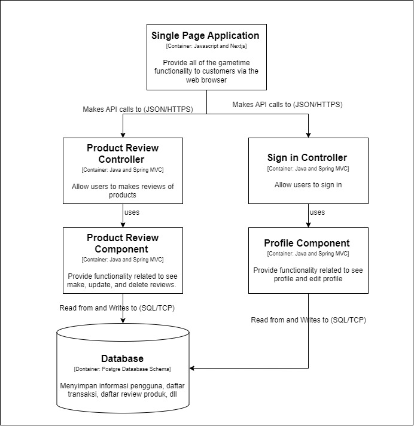
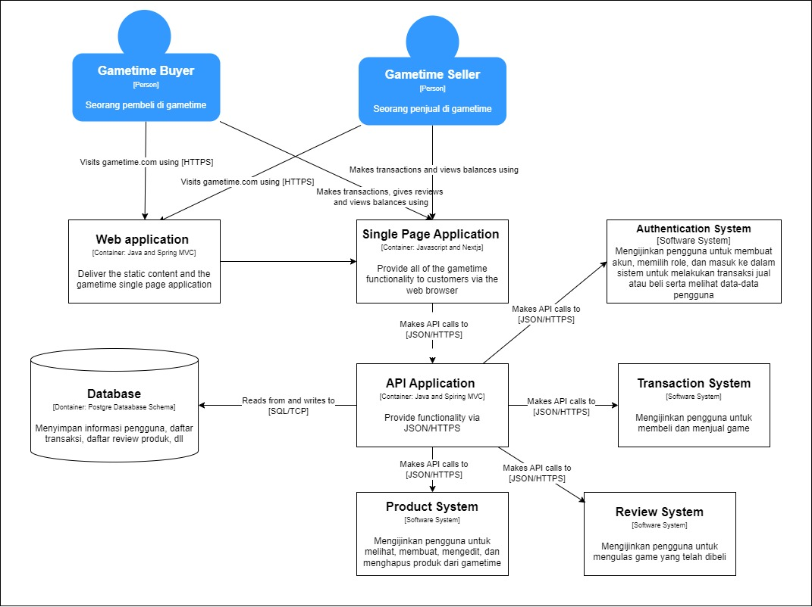

# Game Time

## Link Deployment
https://transaction-p5zxnxph7q-ew.a.run.app/

## Anggota Kelompok
1. Rachel Heningtyas Zanetta Erari - 2206081944
2. Henry Soedibjo - 2206827762
3. Kevin Ignatius Wijaya - 2206083470
4. Robert Benyamin - 2206817383
5. Nadya Hoesin - 2106651673

## System Context Diagram

## Container Diagram

## Deployment Diagram

## Component Diagram (Robert)

## Component Diagram (Nadya)

## Code Diagram (Robert)

## Code Diagrams (Nadya)

## Future System Context Diagram

## Future Container Diagram

## Future Deployment Diagram

## Explanation
Berdasarkan diskusi kelompok A-9, kami merasa bahwa untuk arsitektur ke depannya, kami akan memecah service transaction menjadi beberapa service. Keputusan ini didasarkan pada beberapa pertimbangan utama yang kami yakini akan memberikan manfaat signifikan bagi pengembangan dan pemeliharaan sistem kami.

Pertama, pemecahan service transaction menjadi beberapa service yang lebih kecil dan spesifik akan meningkatkan skalabilitas sistem. Dengan layanan yang lebih tersegmentasi, masing-masing service dapat diskalakan secara independen sesuai dengan kebutuhan beban kerja spesifiknya. Misalnya, beban pada service yang mengurus penjualan produk mungkin berbeda dengan beban pada service yang mengurus ulasan produk, sehingga skalabilitas yang terpisah memungkinkan penggunaan sumber daya yang lebih efisien.

Kedua, pembagian ini akan meningkatkan ketahanan sistem secara keseluruhan. Jika satu service mengalami masalah atau downtime, service lainnya tetap dapat beroperasi tanpa terganggu. Hal ini penting untuk menjaga ketersediaan layanan bagi pengguna akhir, terutama dalam sistem yang menangani transaksi dan ulasan produk yang sangat dinamis.

Ketiga, dari segi keamanan, segmentasi ini memungkinkan penerapan kebijakan keamanan yang lebih spesifik dan terkontrol untuk setiap service. Misalnya, layanan yang menangani transaksi dapat memiliki lapisan keamanan yang lebih ketat dibandingkan dengan layanan yang menangani ulasan produk.

Dengan mempertimbangkan semua faktor tersebut, kami percaya bahwa memecah service transaction menjadi beberapa microservice adalah langkah strategis yang tepat untuk memastikan fleksibilitas, skalabilitas, dan ketahanan sistem kami di masa depan.

